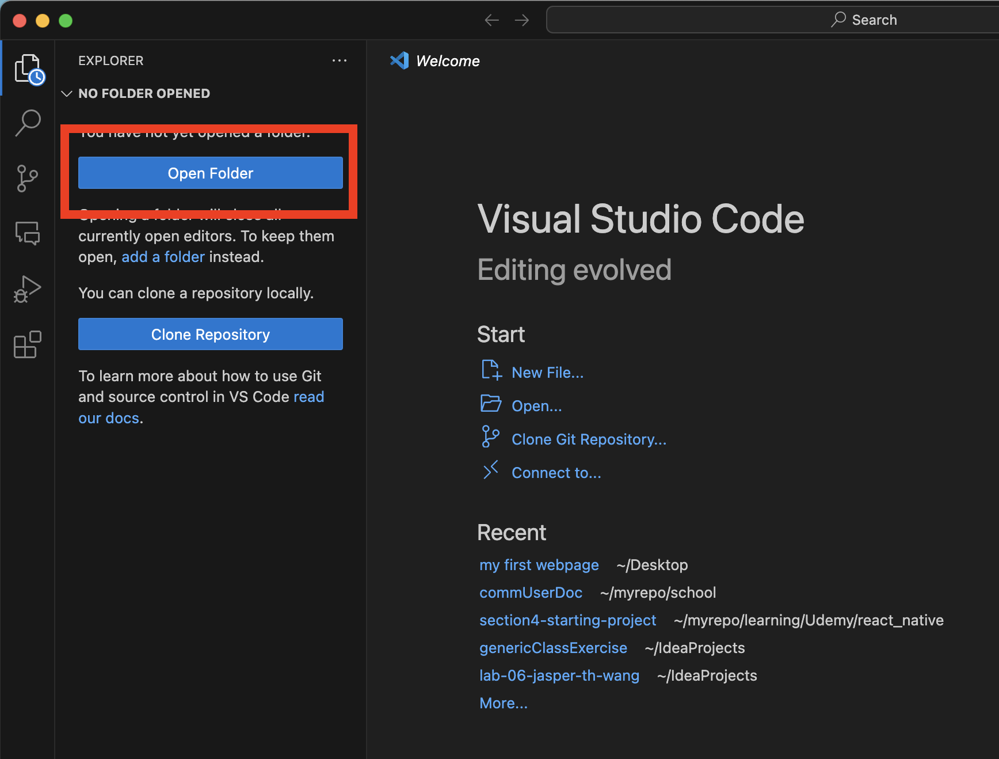
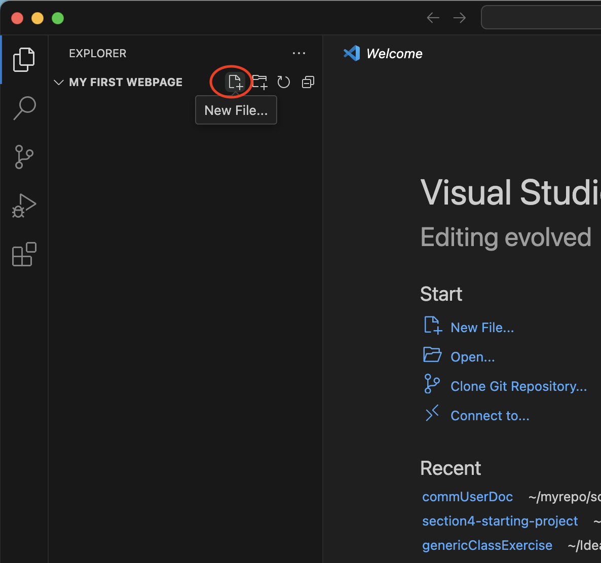
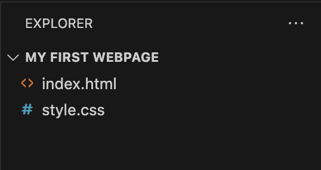
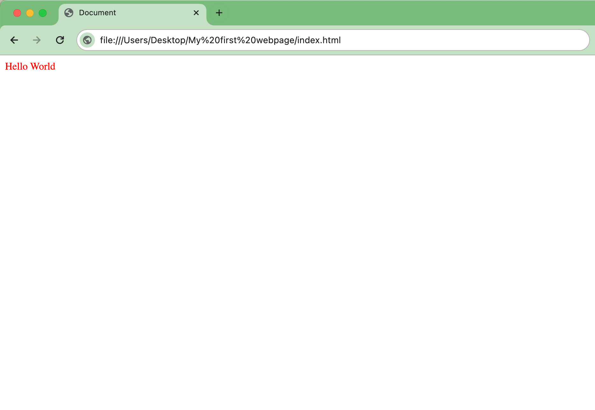

# Setting up your webpage project

This section will show you how to set up a basic webpage project. You will make an HTML file to detail the basic **structure** of your webpage, and a CSS file to give your webpage **style**. You will then link your HTML and CSS files and verify that your CSS styles work by opening your web page using your web browser.

## Setting up your project directory

Before we start writing the HTML and CSS code, it is important to set up an organized project structure as outlined below.

1. Make a folder on your desktop titled “My first website”.
2. Open VS Code.
3. Do any of the following to open your project in VS Code:
    - In VS Code, click **File** > **Open** and find your “My first webpage” folder.
    - In the VS Code Welcome page, select **Open Folder** on the left explorer panel.
      
    
    !!! success

        You should see the title "**MY FIRST WEBPAGE**" on the explorer side panel. This means you have successfully open your folder as a project!
        - 

4. Click the **New file** button.
    
5. Name the new file “index.html” and hit enter.
6. Click the **New file** button again.
7. Name the file “style.css” and hit enter.
8. You should now have a folder with two files in it.

!!! success

    Here is what the project structure will look like.
    ```
    My first website/
    ├── index.html
    └── style.css
    ```
    
    And your explorer panel should look like this.

    

## Linking your CSS file to your HTML file

Now, let's link your CSS file to your HTML file and write some CSS code to style your webpage.

1. In VS Code, open your index.html file.

    !!! note "Basic Structure of a HTML Document"
        An HTML document consists of elements enclosed in tags, defining the structure and content of a webpage. It typically begins with a `<!DOCTYPE html>` declaration followed by `<html>`, `<head>`, and `<body>` tags, where the `<head>` section contains metadata and the `<body>` section holds the visible content.

2. Paste the following code snippet into the file.

    ??? abstract "Code Snippet of the HTML Boilerplate"
         ```html
         <!DOCTYPE html>
         <html lang="en">
         <head>
           <meta charset="UTF-8">
           <meta name="viewport" content="width=device-width, initial-scale=1.0">
           <title>Document</title>
         </head>
         <body>
         </body>
         ```

    !!! note "Metadata in HTML"
        In HTML, the header section contains important information about the document, such as its character encoding, viewport settings for responsive design, and the document's title. Additionally, it can include links to external resources like stylesheets using the <link> tag. To read more about this, see [What's in the head? Metadata in HTML](https://developer.mozilla.org/en-US/docs/Learn/HTML/Introduction_to_HTML/The_head_metadata_in_HTML).

3. Between the **body** tag, type "Hello, world!"
4. Open your folder and double-click on index.html to open it in your browser.
5. Below the **title** tag, paste the following code snippets.

    ??? abstract "Code Snippet"
        ```html
        <link rel="stylesheet" href="./style.css">  
        ```
    !!! note "The `<link>` Tag in HTML"
        The <link> tag in HTML is used to link external resources, such as CSS stylesheets, to a document. Found in the `<head>` section, it specifies the relationship `rel="stylesheet"` and the path `href="path/to/style.css"` to the external file, facilitating the separation of content and style.

6. In VS Code, Open your style.css file and paste the following snippet.
      
    ??? abstract "Code Snippet"
        ```html
        body {
            color: red;
        }
        ```
   
7. Refresh or reopen index.html in your browser and verify that your hello world text is red.
      
!!! success

    Nice job! Here is what your webpage should look like.

    
   
Your accomplishments so far

- [x] Set up a project directory for your webpage.
- [x] Created an HTML file with the basic structure of a webpage.
- [x] Created a CSS file with a style rule to change the color of the text.
- [x] Linked your CSS file to your HTML file.
    