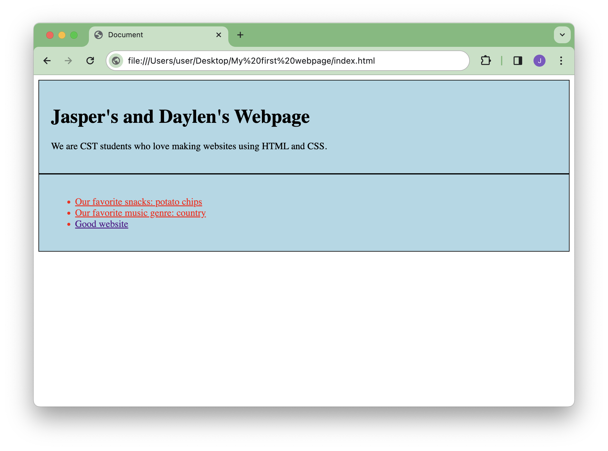

# Styling your website

This section will show you how to style the content you added in the previous section. You’ll use CSS selectors to specify which elements you’ll add which styles to.

## Styling elements using the a type selector

Type selectors target all elements of a specific type. In this example, you will style all list items in your unordered list.

1. Open your `style.css` file and type your first CSS _selector_ `li`, following with a set of curly braces `{}`:

    ```css title="style.css"
    li {
    
    }
    ```
   
    !!! note "CSS selectors"
        CSS selectors are patterns used to select the elements you want to style. They target elements based on their type, class, or ID. In this case, the `li` selector targets all list items in your unordered list.   

2. Inside the curly braces, add the following properties and values:

    ??? abstract "Code Snippet"
         ```css
         color: red;
         text-decoration: underline;
         ```
    !!! note "CSS declarations"
        CSS declarations are made up of a property and a value. The property specifies the style you want to change, and the value specifies the new style. In this case, the `color` property changes the text color to red, and the `text-decoration` property underlines the text.

## Styling multiple elements using classes

Classes are reusable styles that can be applied to multiple elements. In this example, you will create a class to style your headings.

1. In your `style.css` file, type your second CSS _selector_ `.my_intro`, following with a set of curly braces `{}`:

    ```css title="style.css"
    .my_intro {
    
    }
    ```
   
    !!! note "CSS classes"
        CSS classes are reusable styles that can be applied to multiple elements. They are defined using a period `.` followed by the class name. In this case, the `.my_intro` class will be used to style the `div` element that is wrapping the `h1` and `p` content.
   
2. Inside the curly braces, add the following properties and values:

    ??? abstract "Code Snippet"
         ```css
         background-color: lightblue;
         padding: 20px;
         border: 1px solid black;
         ```

3. In your `index.html` file, add the class `my_intro` to the `div` element wrapping the `h1` and `p` content:

    ```html title="index.html"
    <div class="my_intro">
        <h1>Jasper's and Daylen's Webpage</h1>
        <p>We are CST students who love making websites using HTML and CSS.</p>
    </div>
    ```

    !!! note "HTML classes"
        HTML classes are the second part of the CSS class selector. In order for the CSS class to be applied to an element, the class must be defined in the HTML. They are defined using the `class` attribute followed by the class name. In this case, the `my_intro` class is applied to the `div` element wrapping the `h1` and `p` content.
   
4. In your `index.html` file, add the class `my_intro` to the `div` element wrapping the `ul` unordered list:

    ```html title="index.html"
    <div class="my_intro">
        <ul>
          <li>Our favorite snacks: potato chips</li>
          <li>Our favorite music genre: country</li>
          <li><a href="https://catoftheday.com/">Good website</a></li>
        </ul>
    </div>
    ```

5. Save your files and refresh your browser to see the changes.
    
    !!! success "Success"
        You have successfully styled your webpage using CSS selectors and classes. The list items in your unordered list are now red and underlined, and the `div` element wrapping the `h1`, `p` and `li` content has a light blue background, padding, and a black border.
        
        

[//]: # (        TODO: Add images to show the changes in the webpage.)

## All done! 🎉
Here's what you've accomplished in the guide:

- [x] Styled your webpage using CSS selectors and classes.
- [x] Applied styles to list items and a `div` element.
- [x] Learned how to use CSS declarations to change the style of elements.
- [x] And you made a webpage that looks great!